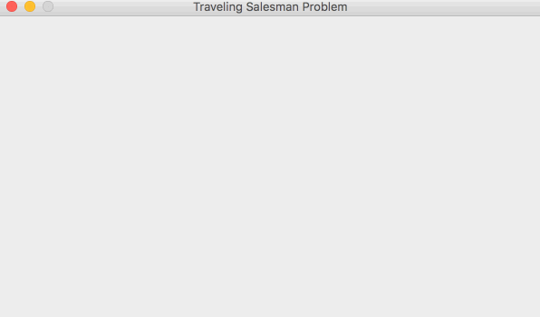

# Ant-Colony-Optimization-for-the-Traveling-Salesman-Problem
A population based stochastic algorithm for solving the Traveling Salesman Problem. 



Output:

```
Mac:AntColonyTSP Laki$ java Main
------------------ANT COLONY OPTIMIZATION------------------
Use the parameter '-p' for custom settings.
Otherwise the default values will be: 
Ants per epoch:           100
Epochs:                   100
Evaporation Rate:         0.1
Alpha (pheromone impact): 1
Beta (distance impact):   5
Best Tour: 20 -> 10 -> 4 -> 15 -> 14 -> 18 -> 17 -> 22 -> 11 -> 19 -> 25 -> 7 -> 23 -> 27 -> 8 -> 24 -> 16 -> 13 -> 1 -> 28 -> 6 -> 12 -> 9 -> 5 -> 21 -> 2 -> 29 -> 26 -> 3 -> 20
Evaluation: 9566
-------------------------COMPLETE--------------------------
```

## Usage

Navigate to the folder containing Main.class.

To run it with the default parameters:
```
java Main
```
To run it with custom parameters:
```
java Main -p
```
